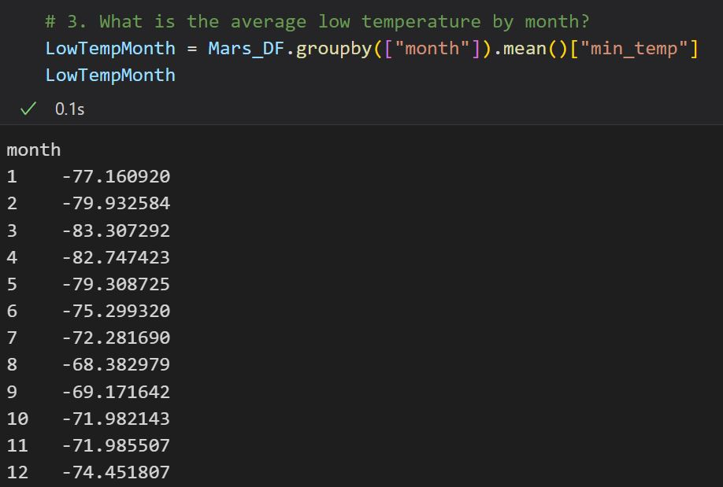
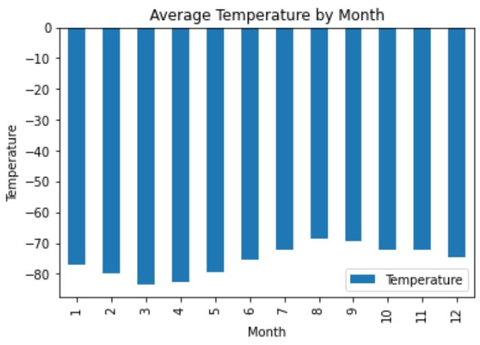
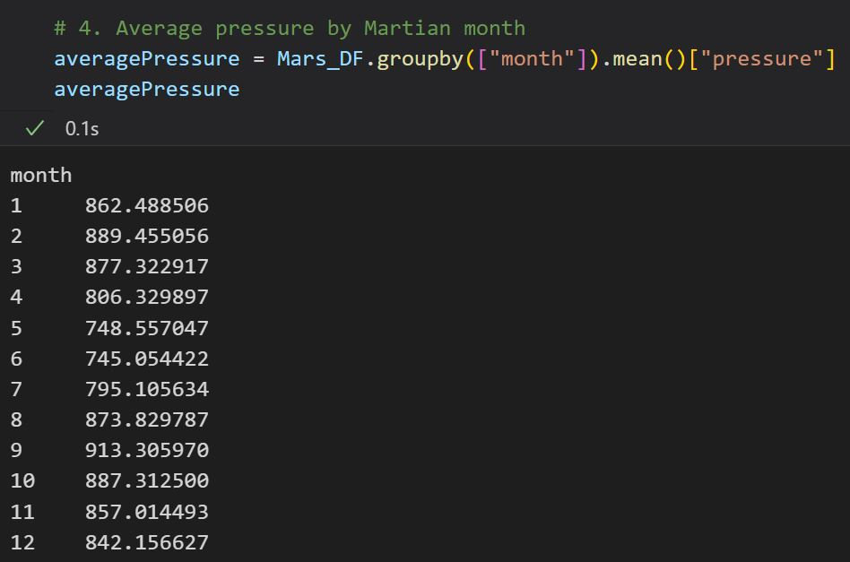
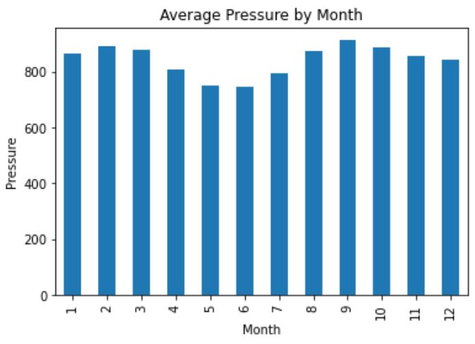
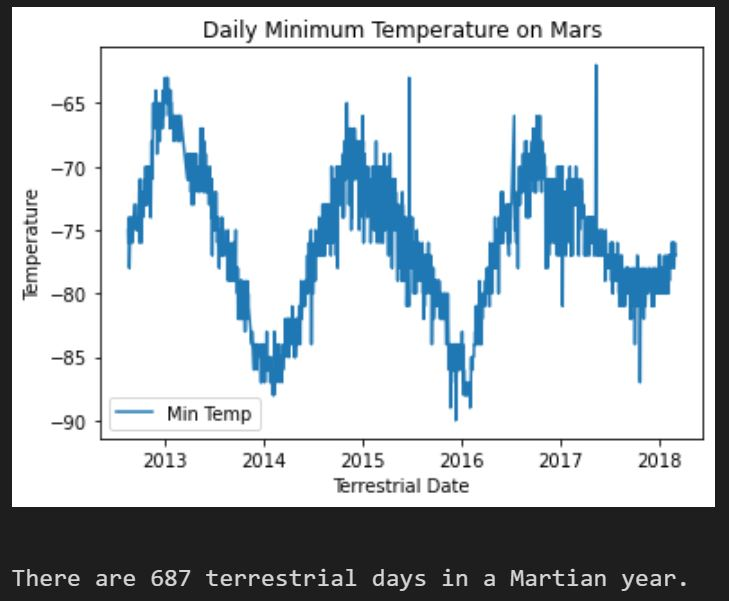

# Mars News and Weather Analysis
This project is focused on web-scraping and data analysis of information related to Mars. The project consists of two parts: Part 1 is a Jupyter notebook containing code that scrapes the Mars news titles and preview text. Part 2 is a Jupyter notebook containing code that scrapes the Mars weather data and that cleans, visualizes, and analyzes that data.

# Technical Skills
- Webscraping 
- Splinter
- Beautiful Soup
- Data analysis using Pandas
- Plotting charts using Matplotlib

# Weather Analysis
#1. How many months exist on Mars?

12
#2. How many Martian (and not Earth) days worth of data exist in the scraped dataset?

1867 days worth of data
#3. What are the coldest and the warmest months on Mars (at the location of Curiosity)?

On average, the third month has the coldest minimum temperature on Mars, and the eighth month is the "warmest". But it is always very cold there in human terms!
#4. Which months have the lowest and the highest atmospheric pressure on Mars? To answer this question:
- Find the average the daily atmospheric pressure of all the months.

- About how many terrestrial (Earth) days exist in a Martian year?

There are 687 Earth days in a Martian year. As visualized by the chart, the distance from peak to peak is roughly 1425-750, or 675 days. A year on Mars appears to be about 675 days from the plot. Internet search confirms that a Mars year is equivalent to 687 earth days.

# Project Parameters
- Deliverable 1: Scrape Titles and Preview Text from Mars News (40 points)
    - Automated browsing (with Splinter) was used to visit the Mars news site, and the HTML code was extracted (with Beautiful Soup)
    - The titles and preview text of the news articles were scraped and extracted
    - The scraped information was stored in the specified Python data structure—specifically, a list of dictionaries

- Deliverable 2: Scrape and Analyze Mars Weather Data
    - The HTML table was extracted into a Pandas DataFrame. Splinter and Beautiful Soup were used to scrape the data. The columns have the correct headings and data types
    - The data was analyzed to answer all five listed questions, with data visualizations provided when specified
    - The DataFrame was exported into a CSV file 